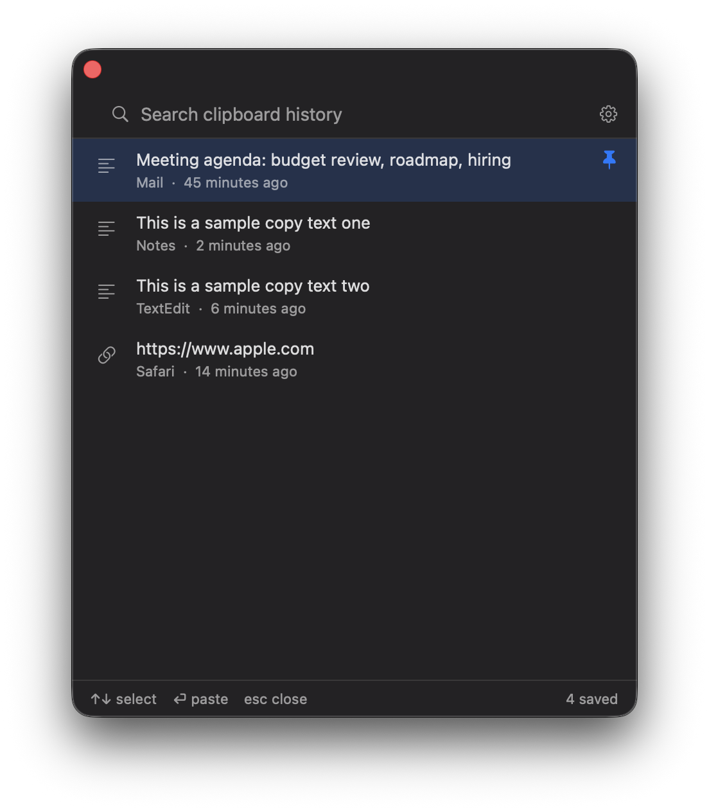

# ClipboardHistory

Every copy you make, remembered. Press **⌘⇧V** to bring up your clipboard
history, click what you need, and it's pasted.

## What it does

- **Remembers everything you copy** — text, links, and images
- **Search as you type** — start typing and matches appear instantly
- **Search by date** — type "7 days ago" or "last week", or pick dates from the calendar
- **One-tap filters** — narrow the list to Links, Emails, Images, Pinned, or Passwords
- **Paste several at once** — ⌘-click a few items, press Return, they paste together
- **Reads text in your screenshots** — images are OCR'd on your Mac, so they're searchable and their text is copyable
- **Clean text by default** — formatting is stripped when you paste; flip one setting to keep it instead
- **Pin your favorites** — pinned items never expire, and you can drag them into your own order
- **Share anything** — right-click an item to send it via AirDrop, Messages, and more
- **Syncs between your Macs** — flip one switch and iCloud keeps your history on both
- **Handles passwords sensibly** — password copies stay on your Mac, get a key icon, and auto-delete after 15 minutes (recording and timing are both adjustable)
- **Your shortcut, your choice** — pick the key combo that suits you in Settings

## Install

1. Download **ClipboardHistory.dmg** from the
   [latest release](https://github.com/kamalahmed/ClipboardHistory/releases/latest).
2. Open it and drag **ClipboardHistory** into **Applications**.
3. First open only: **right-click the app → Open → Open** (macOS warns about
   apps from independent developers — this is expected).

The app lives in your **menu bar** (clipboard icon, top-right of the screen) —
it has no Dock icon. On first launch it opens the history window once so you
can see where it lives.

## Quick tips

| I want to… | Do this |
|---|---|
| Open my history | **⌘⇧V**, or click the menu bar icon |
| Paste an item | Click it, or ↑↓ then Return |
| Paste several items | ⌘-click each one, then Return |
| Find last week's copy | Type "7 days ago" or "last week", or click the 📅 button |
| Find that email / link again | Tap the **Emails** or **Links** chip under the search box |
| Keep original formatting | ⚙ Settings → turn off *Always paste as plain text* |
| Pin / delete | Hover over the item |
| Reorder pinned items | Drag one over another |
| Copy text out of a screenshot | Right-click the image → *Copy Text from Image* |
| Sync with my other Mac | ⚙ Settings → *Sync automatically via iCloud* (both Macs) |
| Let it paste for me | Grant Accessibility when asked — optional; without it you press ⌘V yourself |

## For developers

Build it yourself: open `ClipboardHistory.xcodeproj` in Xcode and press ⌘R —
no signing setup or developer account needed.

Curious how it works? Read **[docs/HOW-IT-WORKS.md](docs/HOW-IT-WORKS.md)** —
a guided tour of the code, written for people new to Swift.
