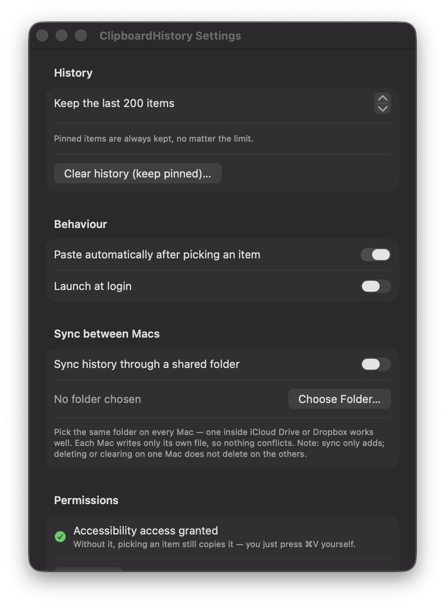

# ClipboardHistory

A menu bar clipboard manager for macOS. Press **⌘⇧V** anywhere, search your
recent copies, hit Enter, and it pastes into whatever app you were in.

- Remembers text and images
- Search, keyboard navigation, pinning
- Skips anything a password manager copies
- No Dock icon — it lives in the menu bar
- Sync between your Macs through a shared folder (iCloud Drive, Dropbox…)
- Everything stays on your Mac (`~/Library/Application Support/ClipboardHistory/`)
  — the app itself never touches the network

---

## Running it

1. Open `ClipboardHistory.xcodeproj` in Xcode.
2. Press **⌘R**.

That's it — no signing setup needed, the project is configured to "sign to run
locally". A clipboard icon appears in your menu bar; the app has no Dock icon,
which is normal.

The first time you use it, macOS will ask for **Accessibility** permission. That
is only needed for the "press ⌘V for you" part. If you decline, picking an item
still copies it to the clipboard and you paste manually. You can grant it later
in Settings → Permissions.

> **Note on permissions and rebuilds:** macOS ties Accessibility permission to an
> app's code signature. Because this builds with an ad-hoc signature, you may
> have to re-grant it after some rebuilds. Annoying, not broken.

### Using it

| Action | How |
|---|---|
| Open the popup | ⌘⇧V, or click the menu bar icon |
| Move through results | ↑ / ↓ |
| Paste the highlighted item | ⏎, or click a row |
| Close | Esc, the red close button, or click elsewhere |
| Pin / delete an item | Hover the row, or right-click it |
| Settings | The ⚙ button in the popup, or right-click the menu bar icon |
| Quit | Right-click the menu bar icon |

### Syncing between Macs

Settings → *Sync between Macs* → choose the **same folder on every Mac** — a
folder inside iCloud Drive or Dropbox works well, because the cloud service
mirrors it between machines for you. Each Mac writes only its own file inside
that folder (`devices/<id>.json`) and merges everyone else's, so no file ever
has two writers and nothing conflicts. Sync only adds: deleting an item on one
Mac does not delete it on the others.

---

## How the code is laid out

Ten small Swift files. Read them roughly in this order:

| File | What it does |
|---|---|
| `ClipboardHistoryApp.swift` | The `@main` entry point. Declares the Settings window; hands everything else to the app delegate. |
| `AppDelegate.swift` | Startup. Creates the menu bar icon, starts the monitor, registers the hotkey. |
| `ClipItem.swift` | The data model for one clipboard entry, plus display helpers. |
| `ClipboardStore.swift` | Holds the list. Saves/loads JSON, de-duplicates, pins, trims, manages image files. |
| `ClipboardMonitor.swift` | Polls the system clipboard 2.5×/second and feeds new content to the store. |
| `GlobalHotKey.swift` | Registers ⌘⇧V system-wide via Carbon. |
| `PanelController.swift` | Shows/hides the floating popup window and performs the paste. |
| `HistoryView.swift` | The SwiftUI popup: search field, list, rows, keyboard handling. |
| `SettingsView.swift` | The settings window. |
| `Paster.swift` | Writes to the clipboard and synthesises the ⌘V keystroke. |
| `SyncManager.swift` | Mirrors history into a shared folder and merges other Macs' files. |

### Concepts worth knowing, if Swift is new to you

**`ObservableObject` / `@Published` / `@ObservedObject`.** This is SwiftUI's
change-tracking system. `ClipboardStore` is an `ObservableObject` whose `items`
array is `@Published`. Any view holding it as `@ObservedObject` automatically
redraws when `items` changes. You never write "reload the list" code.

**`@State` and `@FocusState`.** View-local memory. Normally a SwiftUI view is
a throwaway description that gets rebuilt constantly, so plain variables would
be reset every redraw; `@State` survives. `@FocusState` is the same idea for
"where is the keyboard cursor".

**`@AppStorage`.** A property wrapper over `UserDefaults`. Read and write it like
a normal variable; it persists to disk and triggers redraws.

**Optionals (`String?`, `if let`, `guard let`, `try?`).** Swift makes "might be
missing" part of the type. `if let x = maybeX { }` unwraps it safely; `guard let`
does the same but bails out early; `try?` turns a throwing call into an optional.

**`[weak self]` in closures.** Prevents a retain cycle — the timer holds the
closure, the closure would hold the monitor, the monitor holds the timer. `weak`
breaks the loop so things can be deallocated.

**Why AppKit shows up at all.** SwiftUI still can't express "a borderless
floating panel that appears under the mouse, takes keyboard focus, and vanishes
when you click away". So the window itself is an `NSPanel` (AppKit) whose
contents are a SwiftUI view, glued together by `NSHostingView`.

---

## Things worth building next

- **A shortcut recorder** so ⌘⇧V isn't hard-coded. This is the most-requested
  feature in every clipboard manager and a good exercise in event handling.
- **Exclude apps** — never record from your password manager, Terminal, etc.
- **Fuzzy search** instead of substring matching.
- **Snippets**: pinned items with a keyword you can type to expand.
- **A "clear after N minutes" timer** for anything that looks like a secret.
- **Rich text** — currently everything is flattened to plain text.

## Known rough edges

- Polling every 0.4s is how all clipboard managers work, but it means a copy can
  take up to 0.4s to appear.
- Password-manager filtering relies on apps marking their clipboard writes as
  concealed. Most do; not all.
- The history JSON is not encrypted. It's readable by anything running as you.
